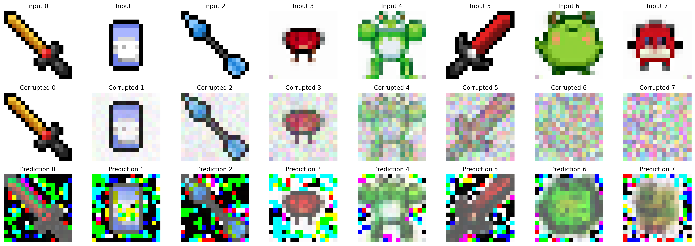

## quick glance

### version1

trained a simplest Unet network without ddpm

input image => add random noise => predict original image

### version2

Unet + ddpm

### version3

Unet + ddpm + ddim

## thanks

- [8bit-diffusion-model](https://github.com/brain-xiang/8bit-diffusion-model/tree/main)
- [huggingface|diffusion course](https://huggingface.co/learn/diffusion-course/unit0/1)
- [The Annotated Diffusion Model](https://huggingface.co/blog/annotated-diffusion)
- [Denoising Diffusion Probabilistic Models](https://arxiv.org/abs/2006.11239) , [Denoising Diffusion Implicit Models](https://arxiv.org/abs/2010.02502)
